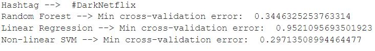
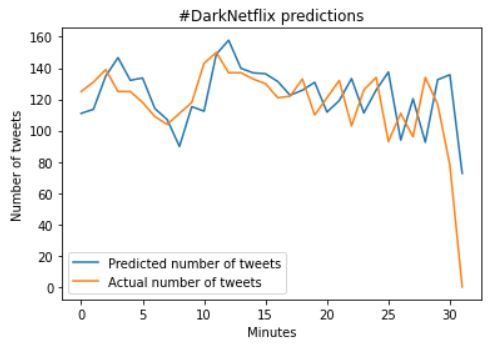
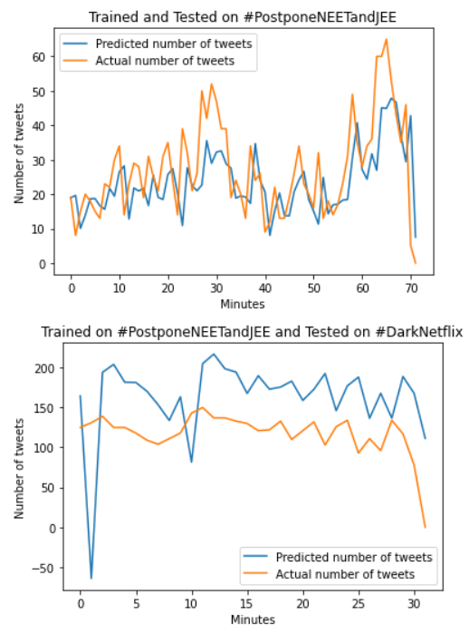

# Hashtag Popularity Prediction
Predicting the popularity of a given hashtag using standard regression techniques such as Linear Regression, Random Forest and Non-linear SVM. 

Done as a part of summer remote project in Northwestern University. Certificate of the project can be found [here](https://drive.google.com/file/d/1yeyoXK8erbeWK9Phm0i_o_XOEqsT3jfs/view?usp=sharing)

## Dependencies

1. numpy
2. tqdm
3. tweepy
4. pandas
5. scikit-learn

## Data Scrapping

NOTE: You need to have a Twitter Developer Account inorder to scrap data. If you don't have access, please apply [here](https://developer.twitter.com/en/apply-for-access)

The data for #DarkNetflix was scrapped from 27/06/2020 for a maximum of 20000 entries. The scrapped data will be in a JSON format. We try to specifically extract the following entities from the data.

1. Number of retweets
2. Number of mentions
3. Number of hashtags
4. Number of urls
5. Number of followers
6. Number of favourites
7. Time at which the post was created (which will be converted to a time stamp)

Once the data is scrapped, we batch entities 1 to 6 with a window of one minute. Therefore, the final data is made with entries corresponding to different minutes.

The popularity of the hashtag is measured by the number of tweets it comprises at a given minute.

## Usage

```
    python main.py
```

## Results



Random Forest and Non-linear SVM has the least cross validation error. 



Looking at the prediction on the test set, we can see that the model is able to predict the popularity very closely to the true value. But training and testing on the same hashtag may induce some bias to the model. Therefore, we have to check if the model is somehow able to capture the trend with regards to other hashtags.



We train the models on #PostponeNEETandJEE which trended in India during mid-june of 2020. As you can see from the first plot, the model is again able to predict somewhat closely with the true value. The interesting part is the plot in the second plot where the model trained on #PostponeNEETandJEE is tested on #DarkNetflix. As expected, the performance of the model has reduced significantly when compared to its performance when the model was trained on #DarkNetflix. Even though the predicted and actual values might be way different, it is able to predict the peaks and valleys with a small delay. Therefore, the model is still consistent with predicting the expected trend of the hashtag.
